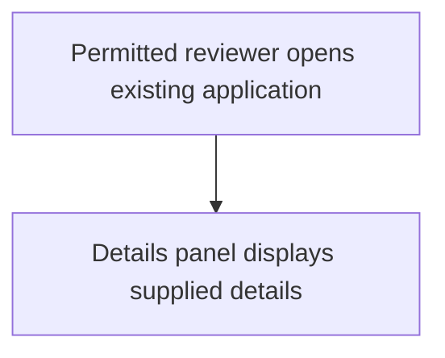

# Metadata and worked authoring examples

Read when filling Story, Test Case or SPEC templates. Examples are illustrative only, not default source facts.

## Metadata retention

Preserve supplied Author, Branch, Requirement ID, Parent Requirement ID, Market, Channel, Customer Type and Customer Segment in the templates where applicable. Keep exact field names; do not replace them with a generic "metadata" line.

Unknown values must not be fabricated. Omit optional unknown fields; if the user's delivery convention requires one, ask for it. Requirement ID is not a score review_id or audit_id. Locally assigned requirement IDs must be clearly identified as local, not portrayed as Jira/source IDs.

SPEC also retains:
- General feature requirements: supplied, approved GitHub commit-specific general-spec link.
- Overall architecture design: supplied, approved GitHub commit-specific architecture.md link.

Include these only when supplied and intended for the business deliverable; otherwise remove the fields. These explicit approved design references are exceptions to the ban on leaking internal evidence locators. Do not leak workspace paths, private download/token URLs, source registers or arbitrary provenance URLs. Test Case Related SPEC remains a workspace reference in the standalone workspace file, never an additional Jira attachment.

## Parser-safe Story example

Assume source explicitly says a permitted reviewer can open an existing application and see supplied details:

```markdown
## Acceptance Criteria

- **AC-001**: Given a permitted reviewer and an existing application, when the reviewer opens the application, then the details panel displays the supplied application details.
```

Use exactly this section heading; add as many real criteria as needed. Stable AC IDs and Given/When/Then preserve BDD without a combined heading. Never create a second AC section just for the scorer.

## Correct negative dispositions

| Source situation | Accurate test design |
|---|---|
| Valid submission and rejection of a specified invalid value are evidenced | Positive case for acceptance plus Validation/Negative case for rejection; Covered appears once on the rejection row. |
| AC itself requires an unauthorized role to be denied access | Permission/Negative test verifies the denial; no artificial successful-access companion is required. |
| Read-only display AC has no meaningful additional negative behavior in confirmed scope | An executable display case with N/A and a specific rationale. |
| Source says rejection is required but does not define observable rejection outcome | Draft To Confirm with the exact missing behavior; no final PASS until evidence resolves it. |
| Two independent binary input dimensions are evidenced | Four supported combinations, excluding any combinations the source declares impossible. |
| One field offers A, B or C | Three cases, not four because the word "or" occurs twice. |

## Executable case illustration

Given supplied invalid-value rule and rejection message, a Validation row specifies the entry role/state, the exact invalid value, ordered input/submit/observe steps and the supplied visible rejection outcome. "Verify appropriate error" is not enough.

Use original 11 columns: Test Case Id; AC / Requirement Ref; Scenario Type; Negative Coverage Status; Coverage Rationale / To Confirm; Priority; Test Case Description; Preconditions; Test Data; Test Steps; Expected Results.

Do not hard-code messages, permission rules, field formats, thresholds or notification targets that evidence does not supply. Verification location belongs in steps/results (screen, returned state or another evidenced observation point).

## Diagram example

For the display-only source above, a sufficient Mermaid shape is:


This is not a default diagram to paste into other Stories. Add error, empty, permission or dependency branches only when evidence supports them, and retain all branches the source explicitly requires.

## Recovery examples

- Correct Story, incorrect SPEC diagram: repair diagram, review affected consistency; reuse current Story score.
- Correct AC, missing test: repair tests and embedded SPEC tables; reuse score.
- Wrong Story requirement: repair from evidence, assess changed Story, update impacted tests/SPEC and review.
- "No Acceptance Criteria section found." with combined heading: correct to canonical heading, preserve business meaning, assess changed bytes.
- Canonical heading still unrecognized: technical recovery, not endless business rewrites.
- Missing approved design: ask for the design or a supported scope decision, not invented UI details.
