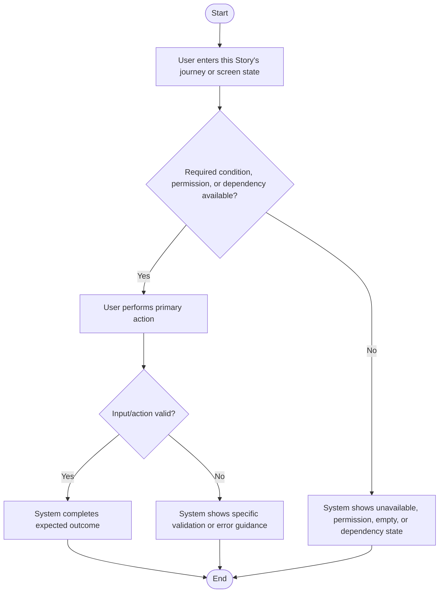

# Review Result

**Result**: [Not Reviewed | PASS | FAIL | NEEDS_REVISION | NEEDS_HUMAN_CLARIFICATION | FINAL_WITH_UNRESOLVED]
**Reviewer Notes**: [Short summary of review outcome, blocking issues, or readiness status]

---

# Feature Specification: [FEATURE NAME]

- **SPEC File Name**: `[short-story-based-spec-name].md`
- **Branch**: `[###-feature-name]`
- **Author**: [Author]
- **Date**: [DATE]
- **Requirement ID**: [UUID]
- **Parent Requirement ID**: [UUID]
- **Status**: Draft
- **General feature requirements**: [GitHub commit-specific URL of the general spec file if available, otherwise this field **MUST** be removed]
- **Overall architecture design**: [GitHub commit-specific URL of the `architecture.md` file if available, otherwise this field **MUST** be removed]
- **Market**: [HK, UK, SG, etc.]
- **Channel**: [mobile, Browser]
- **Customer Type**: [Client, Staff]
- **Customer Segment**: [Retail banking, Private banking, Wealth, CMB, etc.]

<!--
SPEC FILE NAMING RULE:
- Derive the file name before first write from the Story title/summary/purpose.
- Use short lowercase kebab-case ending in `.md`.
- Do not use generic names such as `SPEC.md`, `spec.md`, `story.md`, or `requirement.md` unless the user explicitly requested that exact name.
-->

## Summary *(mandatory)*

[Feature description. Summarize the business goal, user value, and scope of this single story-level specification.]

## User Flow Diagram

[Replace the example below with an evidence-supported Mermaid diagram for this Story. It must reflect the actual user journey, screen state/action/decision/error flow and include relevant success, negative/error, boundary, dependency, empty-state, and permission/security paths. Do not leave the generic example unchanged.]

## Jira Story *(mandatory)*

<!--
This section contains the full Jira Story content and MUST match sibling STORY.md exactly.
Do not use a different simplified story format inside SPEC.
STORY.md is used as the Jira Story description.
-->

# <Story Title>

## Summary

[Concise Jira-ready summary of the independently testable user value delivered by this single Story.]

## User Story

As a <role>, I want <goal>, so that <benefit>.

## Business Context

[Why this story matters to the user, business, journey, or operational outcome.]

## Scope

[In-scope behavior for this single Story. Keep this granular and independently testable.]

## Acceptance Criteria and BDD Scenarios

<!-- Each AC must include executable Given/When/Then scenario detail. -->

- **AC-001**: Given [initial state], when [action/event], then [verifiable expected outcome].
- **AC-002**: Given [initial state], when [action/event], then [verifiable expected outcome].

## Attachments

- SPEC: `<matching-story-named-spec-file-name>.md`

## Test Cases *(mandatory)*

<!--
This section contains the matching executable Test Case content from sibling TEST_CASE.md.
Omit standalone TEST_CASE.md tracking metadata lines here: Author, Date, Requirement ID, Parent Requirement ID, Related Story, Related SPEC, and Status.
The standalone TEST_CASE.md is a user-visible workspace deliverable and must not be exported to Jira separately.
Embed one Test Cases table only. Do not embed a separate AC Coverage Matrix.
Treat `Test Case Description` as the business scenario/title. The embedded table must exactly preserve the sibling table's hard rule: no standalone `or` in a final title, and every alternative must already be split into independently executable source-supported cases.
-->

# Test Cases: [FEATURE / STORY NAME]

## Test Cases

| Test Case Id | AC / Requirement Ref | Scenario Type | Negative Coverage Status | Coverage Rationale / To Confirm | Priority | Test Case Description | Preconditions | Test Data | Test Steps | Expected Results |
|---|---|---|---|---|---|---|---|---|---|---|
| TC01-[Short_Name] | AC-001 | Positive | | | P0 | [Verify the core accepted business outcome for AC-001] | [Required role, state, permission, and dependency] | [Valid business data] | 1. [Open the entry point] 2. [Perform the business action] 3. [Verify the result location] | 1. [Observable accepted outcome] 2. [Required status or data change] |
| TC02-[Short_Name] | AC-001 | Negative | Covered | [Source-supported invalid, rejected, prohibited, or failed condition] | P1 | [Verify AC-001 blocks a source-supported invalid condition] | [Required role, state, permission, and dependency] | [Invalid or disallowed business data] | 1. [Open the entry point] 2. [Trigger the invalid condition] 3. [Verify the result location] | 1. [Observable rejection or error outcome] 2. [No invalid state or data change occurs] |
| TC03-[Short_Name] | AC-002 | Positive | N/A | [Why no meaningful full negative scenario applies] | P0 | [Verify the core accepted business outcome for AC-002] | [Required role, state, permission, and dependency] | [Valid business data] | 1. [Open the entry point] 2. [Perform the business action] 3. [Verify the result location] | [Observable accepted outcome mapped to AC-002] |
| TC04-[Short_Name] | AC-002 | Positive | To Confirm | [Exact missing negative expected behavior] | P0 | [Verify the core accepted business outcome for AC-002 while negative behavior remains to confirm] | [Required role, state, permission, and dependency] | [Valid business data] | 1. [Open the entry point] 2. [Perform the business action] 3. [Verify the result location] | [Observable accepted outcome mapped to AC-003] |
| TC05-[Short_Name] | AC-002 | Boundary | | | P1 | [Verify the source-defined boundary behavior for AC-002] | [Required precondition] | [Boundary value] | 1. [Open the entry point] 2. [Enter or select the boundary value] 3. [Submit and verify] | [Observable boundary outcome mapped to AC-002] |

## Edge Cases

- What happens when [boundary condition]?
  - [Expected system behavior]
- How does the system handle [error, empty-state, dependency, or permission scenario]?
  - [Expected system behavior]

## Requirements *(mandatory)*

### Functional Requirements

- **FR-001**: System MUST [specific capability]
- **FR-002**: System MUST [specific validation, error, dependency, or permission behavior]
- **FR-003**: Users MUST be able to [key interaction]

<!-- If a requirement is unclear, do not pass review. Mark for clarification in the review report rather than hiding unresolved blockers in the SPEC. -->

### Key Entities *(include if feature involves data)*

- **[Entity 1]**: [What it represents, key attributes without implementation]
- **[Entity 2]**: [What it represents, relationships to other entities]

If the feature does not involve data or business entities, use:

- **Not applicable**: This story does not introduce or modify data entities.

## Success Criteria *(mandatory)*

### Measurable Outcomes

- **SC-001**: [Measurable user or business outcome]
- **SC-002**: [Measurable coverage, completion, accuracy, compliance, or operational outcome]
- **SC-003**: [Measurable negative/error/dependency handling outcome when relevant]
